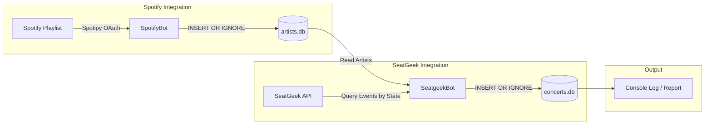

# Spotify Concert Finder Bot (`spotify-api-bot`)

[](https://www.python.org/)
[](https://www.docker.com/)
[](https://www.sqlite.org/)
[](LICENSE)

A headless Python application (either local or via containerization) that extracts all artists from a designated Spotify playlist, persists them into a SQLite database, queries the SeatGeek API for upcoming concerts in a given state, and stores matching events into a dedicated SQLite events database.

---

## Table of Contents

- [Overview](#overview)
- [Key Features](#key-features)
- [Workflow Architecture](#workflow-architecture)
- [Database Schemas](#database-schemas)
- [Prerequisites & API Setup](#prerequisites--api-setup)
  - [1. Spotify API Credentials](#1-spotify-api-credentials)
  - [2. Spotify Playlist ID](#2-spotify-playlist-id)
  - [3. SeatGeek API Credentials](#3-seatgeek-api-credentials)
- [Configuration (`.env`)](#configuration-env)
- [Quickstart: Running with Docker](#quickstart-running-with-docker)
- [Quickstart: Running Locally](#quickstart-running-locally)
- [Modular Execution](#modular-execution)
- [Inspecting the Databases](#inspecting-the-databases)
- [Automating via Cron](#automating-via-cron)
- [License](#license)

---

## Overview

Live music fans often curate their musical tastes on Spotify playlists but miss local tour stops because checking tour schedules manually is tedious. 

**`spotify-api-bot`** bridges this gap:
1. It connects to Spotify's Web API via [Spotipy](https://spotipy.readthedocs.io/) to pull all track artists from a specific playlist.
2. It deduplicates and stores those artists in a local SQLite database (`artists.db`).
3. It iterates through each artist and queries the [SeatGeek API](https://platform.seatgeek.com/) for concerts matching your designated US state.
4. It persists all detected tour dates and venue information to a separate SQLite database (`concerts.db`) and logs the upcoming shows directly to the console.

---

## Key Features

- **🎵 Automatic Spotify Ingestion**: Paginates through any Spotify playlist (public or private collaborative) and retrieves every featured artist.
- **🎟️ Local Concert Discovery**: Automatically converts artist names into SeatGeek performer slugs and checks for upcoming live performances in your region.
- **🗄️ Relational SQLite Persistence**: Cleanly separates concerns with distinct databases for tracked artists and concert listings, utilizing unique constraints to prevent duplicate entries across runs.
- **🐳 Dockerized & Headless**: Ships with a lightweight `Dockerfile` based on `python:3.8-slim-buster`, ready for deployment on home servers, NAS devices, or cloud VMs.
- **⚙️ Environment Variable Driven**: Fully configurable via `.env` file or container environment variables.
- **⏱️ Rate-Limit Friendly**: Incorporates request throttling (`time.sleep`) to comply with third-party API limits gracefully.
- **🧩 Modular Design**: Run the entire pipeline end-to-end with `run.py`, or execute the Spotify and SeatGeek scrapers independently as standalone modules.

---

## Workflow Architecture



---

## Database Schemas

The application initializes and maintains two separate SQLite databases:

### 1. `artists.db` (Table: `artists`)
Stores all distinct artists extracted from your Spotify playlist.

| Column | Type | Description |
| :--- | :--- | :--- |
| `id` | `INTEGER PRIMARY KEY AUTOINCREMENT` | Auto-incrementing identifier |
| `name` | `TEXT UNIQUE` | Artist name (unique constraint prevents duplicates) |
| `playlist_id` | `TEXT` | ID of the source Spotify playlist |

### 2. `concerts.db` (Table: `concerts`)
Stores all concerts found for your tracked artists within the target state.

| Column | Type | Description |
| :--- | :--- | :--- |
| `id` | `INTEGER PRIMARY KEY AUTOINCREMENT` | Auto-incrementing identifier |
| `artist` | `TEXT` | Artist name |
| `event_date` | `TEXT` | Local event date (`YYYY-MM-DD`) |
| `venue` | `TEXT` | Venue name |
| `city` | `TEXT` | City where the concert will take place |
| `state` | `TEXT` | Two-letter US state code |

> [!NOTE]
> A multi-column unique constraint `UNIQUE(artist, event_date, venue, city, state)` ensures that subsequent runs will not insert duplicate concert entries.

---

## Prerequisites & API Setup

### 1. Spotify API Credentials
1. Go to the [Spotify Developer Dashboard](https://developer.spotify.com/dashboard) and sign in.
2. Click **Create App**.
3. Fill in your App name and description.
4. Set the **Redirect URI** to:
   ```text
   http://127.0.0.1:5000/redirect
   ```
   *(Or any local port such as `http://127.0.0.1:8888/callback`, ensuring it matches `SPOTIFY_REDIRECT_URI` in your `.env` file).*
5. From the application settings, note your **Client ID** and **Client Secret**.

### 2. Spotify Playlist ID
To locate your playlist ID:
1. Open Spotify and navigate to your playlist.
2. Click the three dots `...` -> **Share** -> **Copy link to playlist**.
3. The link looks like `https://open.spotify.com/playlist/37i9dQZF1DXcBWIGoYBM5M?si=...`.
4. The string between `/playlist/` and `?` (`37i9dQZF1DXcBWIGoYBM5M`) is your `SPOTIFY_PLAYLIST_ID`.

### 3. SeatGeek API Credentials
1. Sign up or log into [SeatGeek Platform](https://seatgeek.com/build).
2. Register a new application under your developer account.
3. Obtain your **Client ID** and **Client Secret**.

---

## Configuration (`.env`)

Create a `.env` file in the root directory by copying the included `template.env`:

```bash
cp template.env .env
```

Edit `.env` with your credentials:

```dotenv
# Spotify Configuration
SPOTIFY_CLIENT_ID=your_spotify_client_id_here
SPOTIFY_CLIENT_SECRET=your_spotify_client_secret_here
SPOTIFY_REDIRECT_URI=http://127.0.0.1:5000/redirect
SPOTIFY_PLAYLIST_ID=your_spotify_playlist_id_here

# SeatGeek Configuration
SEATGEEK_CLIENT_ID=your_seatgeek_client_id_here
SEATGEEK_CLIENT_SECRET=your_seatgeek_client_secret_here

# Application Configuration
ARTIST_DB=artists.db
CONCERT_DB=concerts.db
STATE_CODE=IL
```

### Environment Variables Reference

| Variable | Required | Description | Example |
| :--- | :---: | :--- | :--- |
| `SPOTIFY_CLIENT_ID` | **Yes** | Spotify Developer Application Client ID | `1a2b3c4d...` |
| `SPOTIFY_CLIENT_SECRET` | **Yes** | Spotify Developer Application Client Secret | `5e6f7g8h...` |
| `SPOTIFY_REDIRECT_URI` | **Yes** | Whitelisted Spotify OAuth Redirect URI | `http://127.0.0.1:8383/redirect` |
| `SPOTIFY_PLAYLIST_ID` | **Yes** | Spotify playlist ID to scrape artists from | `37i9dQZF1DXcBWIGoYBM5M` |
| `SEATGEEK_CLIENT_ID` | **Yes** | SeatGeek Platform Client ID | `MTAxM...` |
| `SEATGEEK_CLIENT_SECRET` | **Yes** | SeatGeek Platform Client Secret | `ab01cd23...` |
| `ARTIST_DB` | **Yes** | Path / filename for artist SQLite database | `artists.db` |
| `CONCERT_DB` | **Yes** | Path / filename for concert SQLite database | `concerts.db` |
| `STATE_CODE` | **Yes** | Two-letter US state postal code for filtering concerts | `IL`, `NY`, `CA`, `TX` |

---

## Quickstart: Running with Docker

Running the application inside a Docker container ensures an isolated and consistent environment.

### 1. Initial Spotify Authentication (Pre-Flight)
Spotipy uses OAuth2 to authorize access to Spotify. On first authorization, Spotify asks you to approve the app in your browser and paste back the redirect URL.

> [!TIP]
> For the smoothest Docker workflow, run the script once locally (or run an interactive container) to generate the `.cache` token file. Once generated, mount `.cache` into the container so subsequent headless runs authenticate silently.

### 2. Build the Docker Image

```bash
docker build -t spotify-api-bot .
```

### 3. Run the Container

Mount your local directory or files so the `.env`, `.cache`, and generated `.db` files persist on your host machine:

```bash
docker run --rm \
  --env-file .env \
  -v "$(pwd)/artists.db:/app/artists.db" \
  -v "$(pwd)/concerts.db:/app/concerts.db" \
  -v "$(pwd)/.cache:/app/.cache" \
  spotify-api-bot
```

Or mount the entire workspace directory into `/app`:

```bash
docker run --rm \
  -v "$(pwd)":/app \
  spotify-api-bot
```

---

## Quickstart: Running Locally

### 1. Clone & Set Up Virtual Environment

```bash
# Clone repository
git clone git@github.com:aday913/spotify-api-bot.git
cd spotify-api-bot

# Create and activate virtual environment
python3 -m venv venv
source venv/bin/activate  # On Windows: venv\Scripts\activate

# Upgrade pip and install dependencies
pip install --upgrade pip
pip install -r requirements.txt
```

### 2. Run the Full Pipeline

```bash
python run.py
```

During execution, `run.py` will:
1. Parse configuration from environment variables / `.env`.
2. Connect to `artists.db` and insert any new artists from your playlist.
3. Connect to `concerts.db` and query SeatGeek for each artist.
4. Output newly discovered concerts:
   ```text
   2026-09-05 21:30:00-INFO: Found concert for artist Arctic Monkeys at United Center on 2026-10-15 in Chicago, IL
   ```

---

## Modular Execution

The application is built modularly. You can run individual components independently:

### Run Spotify Ingestion Only
Extracts artists from the playlist and saves them to `artists.db` without querying SeatGeek:

```bash
python -m spotify_api_bot.botipy
```

### Run SeatGeek Concert Checker Only
Reads artists already stored in `artists.db` and searches for new events:

```bash
python -m spotify_api_bot.seatgeekpy
```

---

## Inspecting the Databases

You can inspect the generated SQLite databases using the standard `sqlite3` CLI or a GUI tool such as [DB Browser for SQLite](https://sqlitebrowser.org/).

```bash
# View tracked artists
sqlite3 artists.db "SELECT id, name FROM artists ORDER BY name ASC LIMIT 10;"

# View upcoming concerts ordered by date
sqlite3 concerts.db "SELECT artist, event_date, venue, city, state FROM concerts ORDER BY event_date ASC;"

# Count upcoming concerts by venue
sqlite3 concerts.db "SELECT venue, COUNT(*) as show_count FROM concerts GROUP BY venue ORDER BY show_count DESC;"
```

---

## Automating via Cron

You can schedule the container to run periodically (e.g., every Monday morning at 6:00 AM) to automatically keep track of new concert announcements:

```bash
0 6 * * 1 cd /path/to/spotify-api-bot && docker run --rm --env-file .env -v $(pwd):/app spotify-api-bot >> /path/to/bot.log 2>&1
```

---

## License

This project is licensed under the [MIT License](LICENSE) - see the LICENSE file for details.
